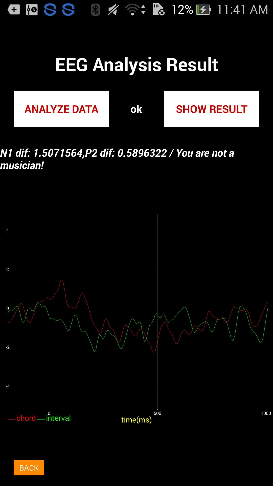

# Files Description
- main: only the main file in the app/src file
- achartengine-1.0.0.jar: .jar for chart-display 

# Add achartengine-1.0.0.jar as Library
1. put the jar (achartengine-1.0.0.jar) into libs folder
2. add the following line in "dependencies" in the app/build.gradle file  
   -> compile files ('libs/achartengine-1.0.0.jar')
3. Click on the "Sync Project with Gradle files"(Left to AVD manager Button on the topbar)

# Get Read/Write File Permission
Add the following in the manifest:\
\<uses-permission android:name="android.permission.INTERNET"/>\
\<uses-permission android:name="android.permission.WRITE_EXTERNAL_STORAGE"/>\
\<uses-permission android:name="android.permission.READ_EXTERNAL_STORAGE"/>

# Run the Project
- Click on the Button "Start" to start the EEG test

- After it stops playing, click on the Button "Result"
- It will jump into another activity. Click on the Button "Analyze Data".

- When it shows a text block "ok", click on the Button "Show Result", it'll show subject's result, including the chord and interval chart and if the subject is a musician.

/***TODO: Musician Evaluation***/
- find N1 P2
- An evaluation to evaluate if the subject is a musician--showed as a scale, ex. 7/10
- set boolean musician in class Result
